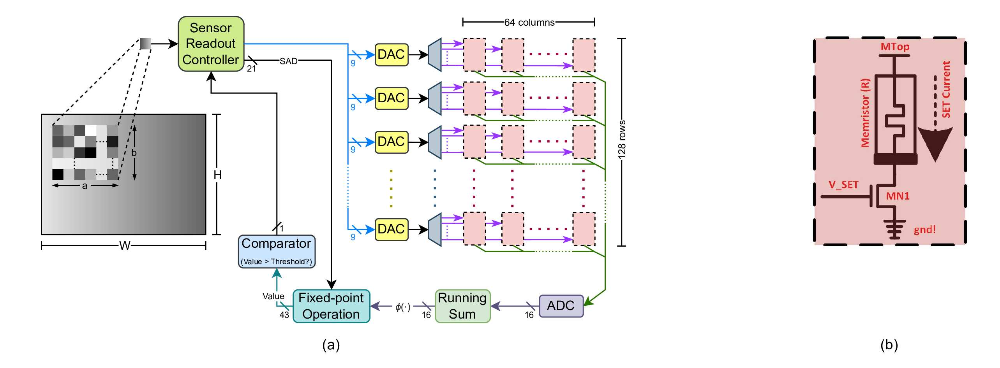

# In_Memory_Template_Matching

## Project Overview

This project presents an **in-memory template matching** framework using an **approximated Pearson Correlation Coefficient (PCC)** computation implemented for **memristive systems**. The goal is to perform efficient template matching while reducing computational overhead, making the approach suitable for **resource-constrained and edge-oriented hardware platforms**.

The workflow begins with an input image and a template image. These are processed through an approximated PCC-based matching pipeline, where similarity is computed efficiently using an in-memory architecture. The final goal is to identify the matching region while preserving accuracy and improving hardware efficiency.

The repository is organized around two main stages:

1. **Template and input preprocessing**
2. **Approximated PCC-based matching and result evaluation**

### Important Code Files

#### `main.py`
This is the main execution script for the project. It runs the complete in-memory template matching pipeline, including loading the input/template data, performing the approximated PCC computation, and producing the final matching result.

Key responsibilities:
- Load input image and template
- Run template matching
- Compute similarity scores
- Produce final detection / matching outputs

#### `pcc.py`
This file contains the implementation of the PCC-based matching logic. It is responsible for computing the similarity between the template and input regions using an approximated formulation suitable for efficient in-memory execution.

Key responsibilities:
- Compute PCC or approximated PCC
- Support efficient matching computations
- Provide similarity metrics for detection

#### `utils.py`
This file contains helper functions used throughout the repository. These may include image loading, preprocessing, normalization, visualization, and output formatting.

Key responsibilities:
- Preprocess input images
- Normalize or reshape template/input data
- Visualize matching results
- Support pipeline execution

### Overall Pipeline

The complete project workflow can be summarized as:

**Input image + template image**  
→ **Preprocessing / formatting**  
→ **Approximated PCC computation**  
→ **Similarity map generation**  
→ **Best match selection**  
→ **Final template matching result**

### Repository Outputs

The repository produces matching outputs and similarity results that can be used for evaluating template localization quality. Depending on the implementation, outputs may include:
- Similarity score maps
- Detected match locations
- Visualization of matched regions
- Performance or evaluation results

## System Setup

Run the following lines to set up the system.

* Create a new environment
  * `conda create --name IMTM python=3.10`

* Activate the environment
  * `conda activate IMTM`

* Install all libraries
  * `pip install -r requirements.txt`

* Install git
  * [installation instruction for windows](https://github.com/git-guides/install-git)

* Change the directory where you want to download all the files
  * `cd Directory`
  * Example: `cd C:/Users/tushar/Documents`

* Download all the files
  * `git clone https://github.com/stushar047/In_Memory_Template_Matching.git`

## Run the code

* For running the code, always make sure that you are in the right environment and working directory
  * `conda activate IMTM`
  * `cd In_Memory_Template_Matching`

* Run the code
  * `python main.py`

## Collect all the files required

There may be two main types of outputs to save depending on the experiment:

1. Image file outputs  
   Example outputs may include:
   - Matching result image
   - Similarity heatmap
   - Template overlay image

2. Data / result files  
   Example outputs may include:
   - Similarity score values
   - Matching coordinates
   - Evaluation CSV or text files

## Check the results to make sure everything is right

* Run the main code
  * `python main.py`

* Verify the outputs by checking:
  * Whether the detected region matches the expected template location
  * Whether the similarity scores are reasonable
  * Whether the output aligns with the reported method in this [paper](https://ieeexplore.ieee.org/document/11014325)

## Reference

If you use this work, please cite:

**In-Memory Template Matching with Approximated PCC Computation Leveraging Memristive System**  [paper](https://ieeexplore.ieee.org/document/11014325)
